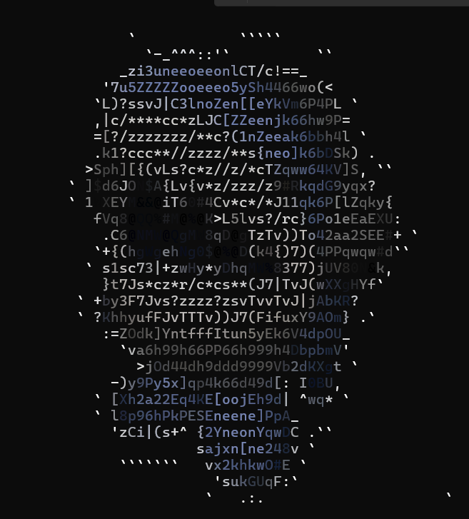

# Oopscii
Ascii art engine, renders images, videos as ascii art (hoping to use this to create an ascii art based game engine)

## usage
1. ```Clone the repo```
2. ```pip install -r requirements.txt```

3. Then :
```cmd
python main.py              -> video feed
python test.py <image_path> -> images (or just use python test.py for the default image)
```

## `monke brain think process :`
- [x] have ascii chars acc to densities. stole from [here](https://stackoverflow.com/questions/30097953/ascii-art-sorting-an-array-of-ascii-characters-by-brightness-levels-c-c)
- [x] pixelate the image to 120 x 30 because too much detail = too many chars
- [x] shit still squashes because ascii is tall -> gpt solved it with `aspect correction`
- [x] still looks bleak, maybe put color ? -> ansi escape codes
- [x] put video, get frames, textify the fframes
- [ ] centre the video / any images
- [ ] get way to find terminal default size / resize terminal
- [ ] make it a proper module / cli tool ?

<br><br>

***

<br><br>

<p float="left">
  
  
</p>

***
